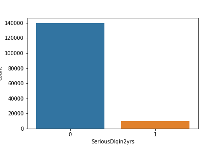
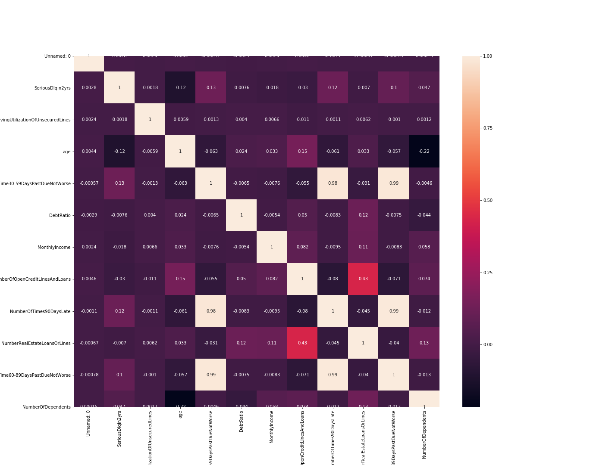
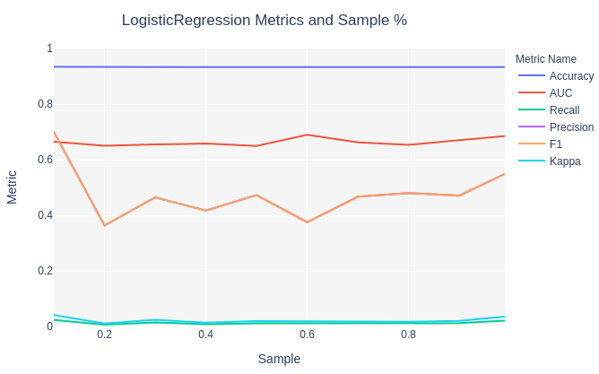
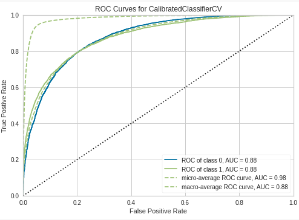
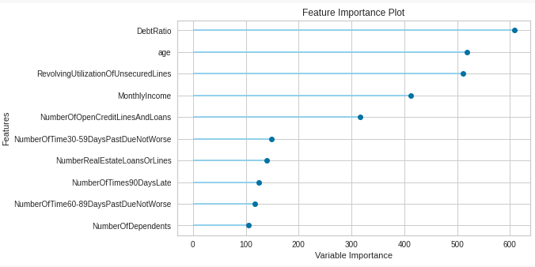
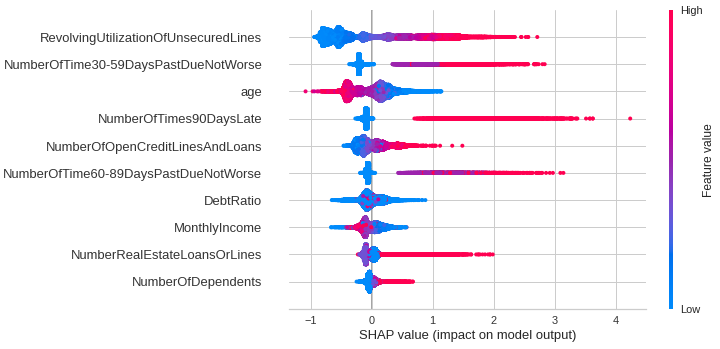
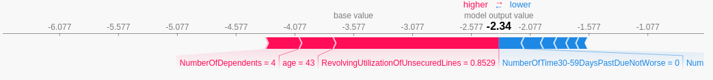
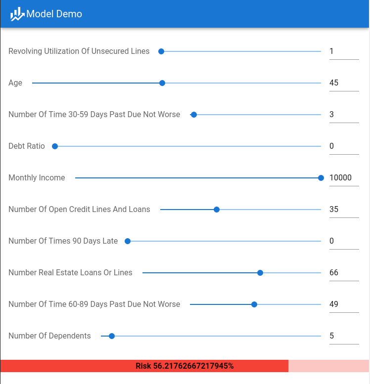
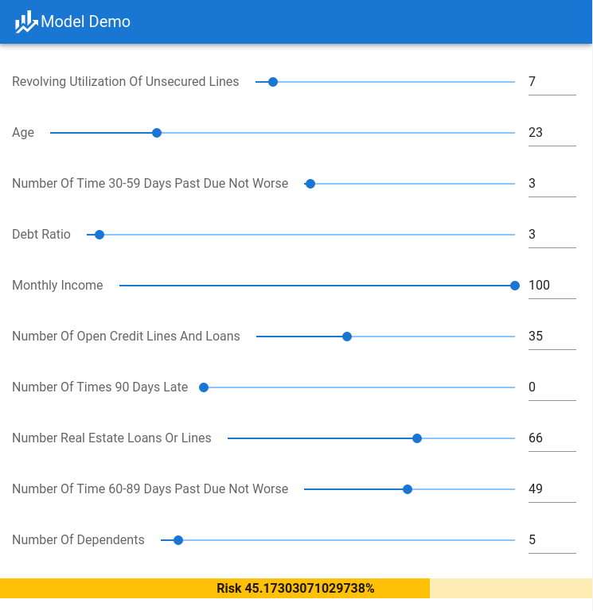
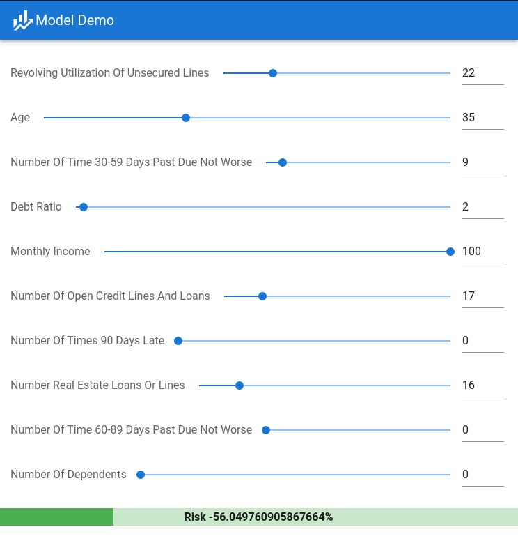

<div align=center style="margin-top:18em;margin-bottom:15em;font-family:'Times','Times New Roman'">
  <p style="font-size:2em">
    <b>风控项目实战之 Give Me Some Credit</b>
  </p>
  <p style="font-size:1.5em">
    <b>金融科技大作业报告</b>
  </p>
  <p style="margin-top:3em;font-size:1.3em;">
    周浩洋
  	曾充
    <br/>
    2020-08-02
  </p>
</div>
<div style="page-break-after: always;"></div>


[TOC]

<div style="page-break-after: always;"></div>

# 1. 选题

本次大作业我们的选题是风险控制，需要针对一个金融科技中的风险控制场景，设计一个新模型，完成分析与报告。初次之外，我们尝试实现了模型的落地，编写了一个简易的前端，能够实时针对给出的客户数据进行风险评估，从而让模型产生实际的意义。

# 2. 研究背景与意义


# 3. 国内外研究现状与存在问题


# 4. 研究目标与研究内容


# 5. 研究方法与模型思路

## 5.1 研究方法

1. 分析数据：我们的项目是基于数据进行的预测，因此数据是一切的基础。这包括对数据集进行分析，研究其样本组成、类别比例，并对数据进行简单的清洗，包括填充空值和处理类别失衡等。
2. 初选模型：针对数据集的特征情况进行模型的初选，在大量模型上使用小规模数据进行基准测试，确定一批候选模型。
3. 精细调节：针对各个模型在更大的数据集上，以提高 AUC 为目标进行精细调节，同时避免模型的过拟合，增强模型的泛化能力。
4. 部署推广：模型在落地之前都是不能产生实际价值的，因此我们将尝试通过在 Web 网站中嵌入模型的方式，实现简单的模型部署落地，让我们的模型能够对实际情况给出指导意见。

## 5.2 模型思路

模型的选取主要有以下考量和思路：

- 数据中的类别极不平衡，因此需要谨慎选择模型，并注意关注模型的泛化能力和 AUC ，不然容易出现模型全部预估某一类别的情况，导致模型失效
- 模型不应过于复杂，否则容易出现过拟合的情况，并且部署成本会较高
- 金融场景中的模型应当具有一定的可解释性，能够对某一具体案例给出评分和理由，而不能是单纯的黑箱

基于以上思路，我们决定采用正则回归模型和集成模型，并在数据集上进行训练和调参，避免过拟合

# 6. 数据集分析

## 6.1 数据标签含义

从 Kaggle 官网获取数据后，我们打开里面的 `Data Dictionary.xls` 文件，可以看到里面的对于每一个标签的解释。

| Variable Name                                | Description                                                  | Type       |
| -------------------------------------------- | ------------------------------------------------------------ | ---------- |
| Serious Dlqin 2yrs                           | Person experienced 90 days past due delinquency or worse     | Y/N        |
| Revolving Utilization Of Unsecured Lines     | Total balance on credit cards and personal lines of credit except real estate and no installment debt like car loans divided by the sum of credit limits | percentage |
| age                                          | Age of borrower in years                                     | integer    |
| Number Of Time 30-59 Days Past Due Not Worse | Number of times borrower has been 30-59 days past due but no worse in the last 2 years. | integer    |
| Debt Ratio                                   | Monthly debt payments, alimony,living costs divided by monthly gross income | percentage |
| Monthly Income                               | Monthly income                                               | real       |
| Number Of Open Credit Lines And Loans        | Number of Open loans (installment like car loan or mortgage) and Lines of credit (e.g. credit cards) | integer    |
| Number Of Times 90 Days Late                 | Number of times borrower has been 90 days or more past due.  | integer    |
| Number Real Estate Loans Or Lines            | Number of mortgage and real estate loans including home equity lines of credit | integer    |
| Number Of Time 60-89 Days Past Due Not Worse | Number of times borrower has been 60-89 days past due but no worse in the last 2 years. | integer    |
| Number Of Dependents                         | Number of dependents in family excluding themselves (spouse, children etc.) | integer    |

不过标签的含义并不是我们关系的重点，我们主要关心的是他们的类型。可以看出这些数据全部都是数值类型的，也就是说我们不需要针对标签、文本等进行特殊的编码处理了。

另外，观察我们需要预测的标签，注意到是一个 `Y/N` 的标签，也就是说我们需要解决的是一个二分类问题。下面我们就对两个类别里的数量进行可视化分析。

## 6.2 类别数量情况

首先将数据导入。

```python
import pandas as pd
data = pd.read_csv('./data/cs-training.csv')
```

通过 `seaborn` 可以绘制出两个类别的数量情况。

```python
plt.figure()
sns.countplot('SeriousDlqin2yrs',data=train_df)
plt.savefig('classes')
```



不难发现类别存在严重的失衡。因此在设计模型的时候需要对此进行修正。

## 6.3 相关性检查

通过 `corr()` 得到各个维度之间的相关性。直接观察数据并不直观，因此我们使用热度图来进行可视化。

```python
# check correlation
corr = train_df.corr()
plt.figure(figsize=(19, 15))
sns.heatmap(corr, annot=True, fmt='.2g')
plt.savefig('heatmap')
```



可以看出大部分特征之间是无关的，只有少数几个特征之间存在相关性，因此我们不对其进行单独的处理。

## 6.4 数据准备工作与特征工程

### 6.4.1 数据预处理

我们首先使用 `setup()` 函数将数据从 `pdarray` 转存到 `pycaret` 中。

```python
clf1 = setup(data=data, target='SeriousDlqin2yrs', numeric_features=['NumberOfTime30-59DaysPastDueNotWorse',
                                                                     'NumberOfTimes90DaysLate',
                                                                     'NumberOfTime60-89DaysPastDueNotWorse',
                                                                     'NumberOfDependents'],
             fix_imbalance=True)
```

这一步有几个需要注意的地方：

1. 首先，我们需要拟合的目标是 `SeriousDlqin2yrs` ，因此需要在 `target` 参数中对其进行指定。
2. 其次，`pycaret` 会自动填充非空值，其默认策略是对数值特征使用均值，对类别标签使用 `"const"` 类别，由于我们的数据只有数值类型，并且我们期望的行为就是直接使用均值进行填充，因此我们不需要对其进行修改。当然，如果需要修改，也可以使用 `numeric_imputation` ， `categorical_imputation` 两个参数进行修改，非常方便。
3. 一开始自动识别的类型中，有 `NumberOfTime30-59DaysPastDueNotWorse`, `NumberOfTimes90DaysLate`, `NumberOfTime60-89DaysPastDueNotWorse`, `NumberOfDependents` 四个类型被错误地识别为了类别编码，因此我们需要手动指定他们的类型，使用 `numeric_features` 参数即可完成。
4. 最后，前面注意到了我们的数据存在严重的类别失衡，因此我们需要对数据进行修复。常见的操作是进行欠采样和过采样，但是 `pycaret` 提供了一个更为先进的方法 SMOTE (Synthetic Minority Over-sampling Technique) 。相较于简单的过采样， SMOTE降低了过拟合风险，对于噪音的抵抗性也更强。不过缺点也是存在的，比如运算开销加大，同时可能会生成一些“可疑的点”。不过总体而言效果优点还是远大于缺点的。另外，因为 `pycaret` 的 SMOTE 利用的是 `imblearn` 这个库，因此这个库中其他支持 `fit_resample` 方法的模块都可以被使用，非常智能。

### 6.4.2 数据集划分

这样导入数据之后，`pycaret` 会自动在不同的采样比例下选取数据，然后使用简单的逻辑回归模型进行拟合。拟合效果如下：



由此可见，对于我们的数据，不同的采样比例影响并不是很大。因此，我们直接采用 `pycaret` 的自动划分来帮我们针对不同模型进行划分和训练。

### 6.4.3 组合特征

在刚刚的分析中，我们发现我们的数据集特征之间相关性不大，并且特征数量不是很多，因此我们不需要进行组合特征等特征工程，只需要将数据交给模型即可。

# 7. 实验与分析

## 7.1 优化目标

首先，我们需要明确优化的目标。Kaggle 的评分规则中，明确指出了将 AUC 指标作为评分的标准，因此我们也需要围绕如何提示 AUC 来进行优化。

## 7.2 对比模型基准性能

简单对数据进行分析之后，我们使用主流模型的默认参数来对这些数据进行基准测试。

原先我们使用了一批sklearn中的模型来测试AUC等指标，**但是刚刚发布的 `pycaret` 2.0 版本包含了更加丰富的功能，因此我们使用这个库对我们的代码进行了重构。**在 `pycaret` 中，我们可以直接使用 `compare_models` 方法进行基准测试，并选取效果最好（即 AUC 指标最高）的几个模型来进行下一步的调整。

```python
# compare all baseline models and select top 5
top5 = compare_models(n_select=5, sort='AUC', turbo=False)
```

默认情况下，面对分类问题 `pycaret` 会选取准确度作为排序指标，因此我们需要手工指定将 AUC 作为指标。另外 `pycaret` 会自动跳过需要较长训练时间的模型（即启用 `turbo`），在这里为了拟合效果我们也要在参数中关闭 `turbo` ，来获得尽可能好的效果。

基准测试结果如下：

| | Model | Accuracy                        | AUC    | Recall | Prec.  | F1     | Kappa  | MCC    | TT (Sec) |
| :---- | :------------------------------ | :----- | :----- | :----- | :----- | :----- | :----- | :------- | ------- |
| 0     | Light Gradient Boosting Machine | 0.9363 | 0.8616 | 0.2296 | 0.5571 | 0.3251 | 0.2977 | 0.3303   | 1.4324  |
| 1     | CatBoost Classifier             | 0.9351 | 0.8599 | 0.2050 | 0.5381 | 0.2969 | 0.2700 | 0.3050   | 12.8907 |
| 2     | Extreme Gradient Boosting       | 0.9350 | 0.8555 | 0.2059 | 0.5370 | 0.2975 | 0.2704 | 0.3052   | 13.5667 |
| 3     | Gradient Boosting Classifier    | 0.9292 | 0.8541 | 0.3349 | 0.4600 | 0.3875 | 0.3510 | 0.3560   | 26.8174 |
| 4     | Ada Boost Classifier            | 0.9164 | 0.8404 | 0.4333 | 0.3883 | 0.4093 | 0.3645 | 0.3653   | 5.8531  |
| 5     | Extra Trees Classifier          | 0.9293 | 0.8304 | 0.2865 | 0.4543 | 0.3512 | 0.3158 | 0.3253   | 2.5105  |
| 6     | Logistic Regression             | 0.8553 | 0.8073 | 0.5831 | 0.2557 | 0.3541 | 0.2877 | 0.3189   | 0.8100  |
| 7     | Quadratic Discriminant Analysis | 0.8282 | 0.7916 | 0.6281 | 0.2365 | 0.3391 | 0.2678 | 0.3102   | 0.0399  |
| 8     | Random Forest Classifier        | 0.9298 | 0.7887 | 0.2196 | 0.4494 | 0.2948 | 0.2624 | 0.2813   | 0.5340  |
| 9     | Naive Bayes                     | 0.9331 | 0.7082 | 0.0578 | 0.4936 | 0.1026 | 0.0901 | 0.1501   | 0.0250  |
| 10    | Linear Discriminant Analysis    | 0.6524 | 0.6983 | 0.6248 | 0.1146 | 0.1937 | 0.0910 | 0.1449   | 0.1400  |
| 11    | Decision Tree Classifier        | 0.8913 | 0.6104 | 0.2851 | 0.2383 | 0.2596 | 0.2014 | 0.2024   | 0.7692  |
| 12    | K Neighbors Classifier          | 0.7514 | 0.5961 | 0.3651 | 0.1059 | 0.1641 | 0.0675 | 0.0855   | 0.2557  |
| 13    | SVM - Linear Kernel             | 0.6688 | 0.0000 | 0.3427 | 0.2153 | 0.0903 | 0.0405 | 0.0619   | 0.5085  |
| 14    | Ridge Classifier                | 0.6524 | 0.0000 | 0.6248 | 0.1146 | 0.1937 | 0.0910 | 0.1449   | 0.0355  |

可以看出，`Light Gradient Boosting Machine`， `Extreme Gradient Boosting`, `CatBoost Classifier` 等模型同时拥有较好的准确度表现和AUC指标，因此我们选取他们来做进一步的优化。

## 7.3 使用 AutoML

`pycaret` 中内置了一些自动化机器学习的工具，可以直接使用这些工具自动完成模型的参数调整，避免手工调整的重复劳动。我们使用以下代码来实现AutoML：

```python
# tune top 5 base models
tuned_top5 = [tune_model(i, optimize='AUC') for i in top5]
# ensemble top 5 tuned models
bagged_top5 = [ensemble_model(i, optimize='AUC') for i in tuned_top5]
# blend top 5 base models
blender = blend_models(estimator_list=top5, optimize='AUC')
# select best model
best = automl(optimize='AUC')
```

下面我们将对这些代码进行解释。

## 7.3.1 超参数调节

众所周知，一个模型的超参数对于模型的拟合效果有着重要的影响。`tune_modal()` 可以自动调整模型的超参数，它使用随机漫步，在默认值周围随机选取10组参数进行训练，并选择指定指标最好的一组（比如在这里就是 AUC 分数最高的一组）最为最终参数。当然，选取的组合数量越多，效果肯定越好，所以当最后确定了模型种类之后，可以增加组合数量进行精细调节。

相关代码如下：

```python
# tune top 5 base models
tuned_top5 = [tune_model(i, optimize='AUC') for i in top5]
```

### 7.3.2 集成学习

使用集成学习可以让我们紧紧借助简单的模型组合出更为精准的模型。其核心策略就是将已有模型进行组装，从而得到效果更好的模型。常见的策略有 Bagging 和 Boosting，这里我们使用 Bagging 策略，来组合出效果更好的模型。

```python
# ensemble top 5 tuned models
bagged_top5 = [ensemble_model(i, optimize='AUC') for i in tuned_top5]
```

### 7.3.3 混合模型

混合模型引入了“共识”的机制，采用表决的方法来综合多个模型的预测结果、分配不同模型相应的权值，并获得最后的概率。使用混合模型能够将我们之前的各个模型融合在一起，`pycaret` 中内置了相关的实现，我们直接调用就好。

```python
# blend top 5 base models
blender = blend_models(estimator_list=top5, optimize='AUC')
```

### 7.3.4 选取最优

在前面的各个步骤中，我们产生了大量的中间模型。`pycaret` 自动帮我们记录了所有的模型，并引入 AutoML 的接口，能够从所有训练得到的模型中选取效果最好的那个。

```python
# select best model
best = automl(optimize='AUC')
```

## 7.4 精修模型

### 7.4.1 校准模型

我们刚刚训练的模型是针对分类问题的，但是实际上为了获得更好的 AUC 分数我们需要对模型预测的概率（置信度）进行精细校准。使用 `pycaret` 中的 `calibrate_model()` 方法，就会自动调用 `sklearn` 中的相关方法，生成一个校准过后的 `CalibratedClassifierCV` 模型。

```python
# calibrate
calibrated_best = calibrate_model(best, verbose=False)
```

### 7.4.2 完善模型

前面的所有 AutoML 训练都是在 30% 的数据集上进行的，目的是加快训练速度以及避免过拟合。但是在交付模型前，我们还是希望在完整的数据集上进行训练。使用 `pycaret` 中的 `finalize_model()` 方法

```python
# finalize model
final_clf = finalize_model(best)
```

## 7.5 可视化模型

为了对我们获得的模型有一个直观、感性的认识，我们对模型进行可视化。

### 7.5.1 模型结构

首先，我们将模型打印一下，看看其结构。

```python
final_clf

CalibratedClassifierCV(base_estimator=BaggingClassifier(base_estimator=<catboost.core.CatBoostClassifier object at 0x7f8526c65630>,
                                                        bootstrap=True,
                                                        bootstrap_features=False,
                                                        max_features=1.0,
                                                        max_samples=1.0,
                                                        n_estimators=10,
                                                        n_jobs=-1,
                                                        oob_score=False,
                                                        random_state=1559,
                                                        verbose=0,
                                                        warm_start=False),
                       cv=10, method='sigmoid')
```

可以看到这是一个三层嵌套的模型，最外部为一个 `CalibratedClassifierCV` 校准模型，内部是一个集成学习的 `BaggingClassifier` ，最底层是 `CatBoostClassifier` 。

### 7.5.2 AUC 曲线

使用 `plot_model(final_best, plot='auc')` 可以很方便的获取 AUC 曲线图。



可以看出在已知数据集上，我们的AUC达到了0.88，属于相当不错的效果。

### 7.5.3 特征重要性

另一个需要可视化的重要属性就是模型中的各个特征所占的权重。

不过因为我们的最终模型是一个嵌套模型，已经无法直接得到各个特征所占的权重，因此我们选取中间的一些简化模型来进行可视化，主要是最底层作为基础模型的那些。

将重要特征进行可视化的方式也很简单。

```python
plot_model(top5[0], plot='feature')
```



可见 `Debt Ratio`, `age`, `Revolving Utilization Of Unsecured Lines` 等特征的权重较大。

## 7.6 解释模型

对于金融科技的模型，我们希望它不只是黑盒，而是有着实际意义的可解释模型。为此，我们使用夏普利值 Shapley Values (SHAP) 来评价树模型中的特征对于结果的贡献度，这样会比单纯看特征重要性更具有指导意义。

### 7.6.1 SHAP 特征解释

使用 `interpret_model()` 方法来对模型的特征进行解释。

```python
interpret_model(tuned_top5[1])
```



这张图反应了不同特征上每一个样本的特征值对于模型输出的贡献。一般来说，区分度越好（即聚集现象越少）的特征，效果会比较好。

那么这里就得到了一个与前面特征重要性差别较大的结论了，可以注意到不少特征比如age、debt retio，虽然权重较大，但是SHAP值分析中的聚集现象也非常严重。可能是因为区分度高的特征并不需要很大的权重就可以将不同的样本区分开、而区分度较低的特征为了能够对最终结果产生影响可能会需要更大的权重，同时也说明，相比权重而言，SHAP 这种基于博弈论的分析方法对于模型的解释可能有着更好的效果。

### 7.6.2 SHAP 单个样本解释

使用 `interpret_model()` 方法来对单个样本的输出进行解释。在这里我们随机选取的是10号样本，根据数据集这是一个阴性样本。

```python
interpret_model(tuned_top5[1], plot='reason', observation=10)
```



从图中可以看到它的每一个特征对于最终的结果产生了怎样的效果。可能对于生成针对单个客户的分析报告等会有较大帮助。

## 7.7 进行预测

最后我们使用最终版的模型进行预测，输出每一个测试样本的概率值，并上传结果到 Kaggle 进行评测。

```python
# prediction
test_data = pd.read_csv('data/cs-test.csv')
predictions = predict_model(final_clf, data=test_data)
import numpy as np
submission_scores = predictions['Score']
ids = np.arange(1, 101504)
submission = pd.DataFrame( {'Id': ids, 'Probability': submission_scores})
submission.to_csv('submission_pycaret_automl.csv', index=False)
```

将 `submission_pycaret_automl.csv` 上传，查看得分：


非公开数据集 AUC 为0.86849，公开数据集 AUC 0.86253，榜首的得分是 0.86955（非公开）和 0.86390（公开），可以看出我们的模型效果还是很不错的。

## 7.8 模型部署

最后我们来尝试对模型进行“落地”工作，即尝试简单部署一个基于Web的模型推理工具，能够实时的针对输入的用户数据，给出相应的风险评估。

### 7.8.1 模型导出

为了做到实时，我们选择将模型直接到处到网页的 js 中，而这需要我们对模型进行简化——太过复杂的模型不仅会增加网页的大小、拖慢打开速度，还会造成较为严重的性能问题。同时，还要考虑能否简单快速的从现有模型中导出——毕竟手写一个推理实例工作量太大了。

很快我们找到了一个名为 `sklearn-porter` 的库，它能够将一些简单的 sklearn 模型的推理功能，输出到支持的语言中，进行直接部署。我们对照着 js 中支持的语言和前面的基准测试结果，选定使用 `Ada Boost Classifier` 作为我们部署阶段的分类器。

```python
from sklearn.tree import DecisionTreeClassifier
base_estimator = DecisionTreeClassifier(max_depth=4, random_state=0)
gbc_clf = sklearn.ensemble.AdaBoostClassifier(base_estimator=base_estimator, n_estimators=32,
                         random_state=0, learning_rate=0.1)
gbc_clf.fit(X_train, y_train)
gbc_clf_scores = gbc_clf.predict_proba(X_train)[:, 1]
fpr_gbc, tpr_gbc, thres_gbc = roc_curve(y_train, gbc_clf_scores)
plot_roc_curve(fpr_gbc, tpr_gbc)
print ('AUC Score:', roc_auc_score(y_train, gbc_clf_scores))
```

通过简单的训练，我们得到了一个 AUC 为 0.85664 的模型，虽然比不上之前那个更为复杂的模型的效果，但是作为部署使用还是足够了的。

接着我们使用 `porter` 将这个模型导出到 js：

```python
from sklearn_porter import Porter

porter = Porter(gbc_clf, language='js')
output = porter.export(embed_data=True)

with open('AdaBoostClassifier.js', 'w') as f:
    f.write(output)
```

这样我们就得到了一个可能用来预测推理的模型代码了。

### 7.8.2 Web 整合

我们使用 Vue + Vuetify 构建了一个简单的 Web 界面，其上半部分由10个特征的输入模块组成，下半部分会实时计算并输出预测的风险值，并通过颜色变化直观地展示给用户。下面是一些输入下展示的风险情况：

- 高风险：



- 中等风险：



- 低风险：




# 8. 结论与展望

在这个项目中，我们通过对数据特征进行分析、挖掘、特征工程，并结合使用各种机器学习模型，设计、优化、测试了一个风险预估模型，并在 Kaggle 中获得了 0.86849 的得分，可以说是非常不错了。最后我们还尝试简单实现了模型的落地，让我们的模型拥有了实际应用的价值。

整个项目让我们了解到了机器学习的基本流程，对金融科技、特征工程、大数据等有了基本的认知，也更对金融科技的未来充满向往。除了课程中所设计的大数据存储、机器学习方法、智能投顾等，许多其他技术诸如云计算、区块链等都能参与到 FinTech 的发展中，为金融科技的进一步发展添砖加瓦。

技术服务于金融创新，而金融创新带来的红利又能进一步促进科技的进步。随着持续的资金、关注和支持，金融科技在未来三年会有怎样的发展？我们非常期待。


# 9. 参考文献

1. PyCaret:  An open source low-code machine learning library. [https://pycaret.org/](https://pycaret.org/)
2. scikit-learn: Machine Learning in Python. [https://scikit-learn.org/](https://scikit-learn.org/)
3. sklearn-porter: Transpile trained scikit-learn estimators to C, Java, JavaScript and others. [https://github.com/nok/sklearn-porter](https://github.com/nok/sklearn-porter)
4. 央行万字长文披露《金融科技（FinTech）发展规划》 [https://finance.qq.com/a/20190823/008846.htm](https://finance.qq.com/a/20190823/008846.htm)
5. Weiming, J., n.d. *Mastering Python For Finance - Second Edition*.
6. Sun, J., Jia, M. Y., & Li, H. (2011). AdaBoost ensemble for financial distress prediction: An empirical comparison with data from Chinese listed companies. *Expert Systems with Applications*, *38*(8), 9305-9312.
7. Aziz S., Dowling M. (2019) Machine Learning and AI for Risk Management. In: Lynn T., Mooney J., Rosati P., Cummins M. (eds) Disrupting Finance. Palgrave Studies in Digital Business & Enabling Technologies. Palgrave Pivot, Cham
8. Leo, M., Sharma, S., & Maddulety, K. (2019). Machine learning in banking risk management: A literature review. *Risks*, *7*(1), 29.

